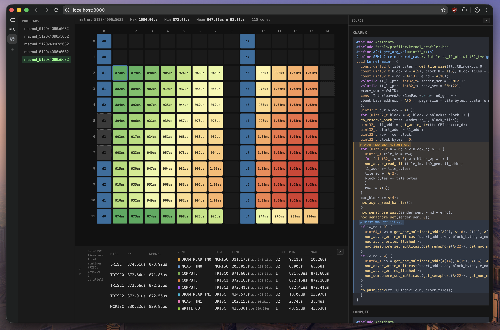

## blackhole-py

A minimal Python driver for the Tenstorrent Blackhole accelerator. Compiles and dispatches RISC-V kernels directly from Python — no TT-Metal runtime required.

> **~4k lines of code** — the entire driver, compiler, firmware, and dispatch stack. TT-Metal's `tt_metal/` directory alone is ~430k lines of C++.

Does not support P150A or multi-chip / distributed yet.

### Setup

```sh
./setup-deps.sh   # downloads SFPI compiler toolchain + TT-Metal headers
```

### Matmul

```sh
PYTHONPATH=. uv run examples/matmul_peak.py 4096 4096 4096
```

### Profiler

Set `PROFILE=1` to capture per-core, per-RISC cycle-level traces. After the run, the profiler serves a web UI at `localhost:8000` with a core heatmap grid, per-RISC timing breakdowns, zone analysis, and annotated kernel source.

```sh
PYTHONPATH=. PROFILE=1 uv run examples/matmul_peak.py
```

<p align="center"></p>

### Dispatch modes

```sh
PYTHONPATH=. uv run examples/matmul_peak.py              # fast dispatch (on-device CQ)
PYTHONPATH=. TT_USB=1 uv run examples/matmul_peak.py     # slow dispatch (over UT3G USB adapter)
```

Fast dispatch uses on-device command queues (prefetch + dispatch cores). Slow dispatch (`TT_USB=1`) drives the chip over the UT3G USB-C adapter via host TLB writes.

### Requirements

- **Hardware**: Blackhole P100A only
- **Kernel driver**: tt-kmd >= 2.6.0
- **Firmware**: < 19.5
- **Python**: 3.10+, numpy

